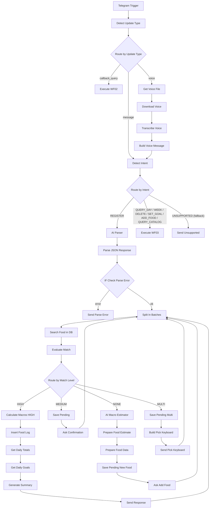
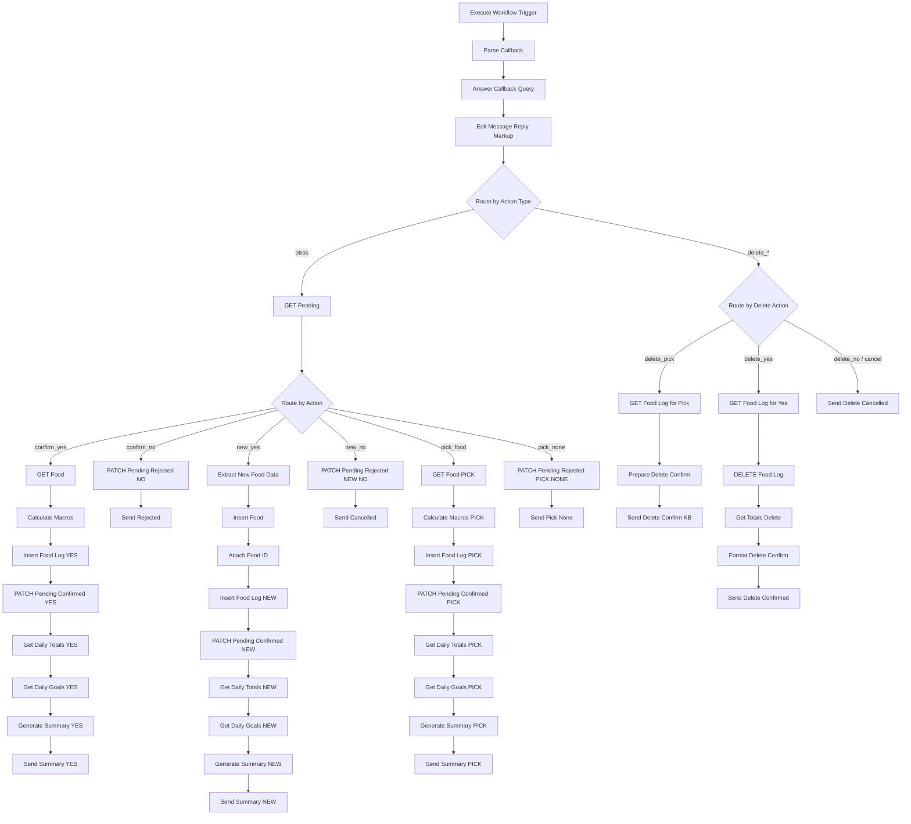
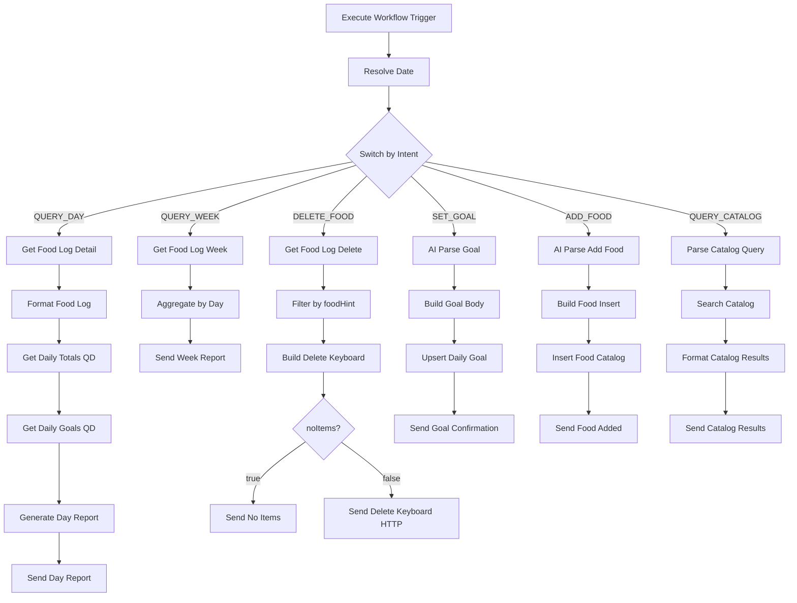

# Mapa de Workflows n8n

## 🚀 Inventario de Workflows
| # | Nombre | ID | Trigger | Estado |
|---|---|---|---|---|
| 01 | Food Logger Main | Xui6wSLHj0aP9cDx | Telegram trigger | ✅ Activo |
| 02 | Confirm Pending | YBOxhz5Svx2VWFj4 | Execute workflow trigger | ✅ Activo |
| 03 | Queries | 3lmsNaaqQamnFOd7 | Execute workflow trigger | ✅ Activo |
---

## Workflow 01: Food Logger Main
Procesa lenguaje natural y decide la ruta de registro (Directo, Confirmación o Estimación).

## Workflow 02: Confirm Pending
Gestiona callbacks de botones para confirmar registros pendientes o ejecutar borrados.

## Workflow 03: Queries
Gestiona consultas de historial, eliminación, metas, catálogo y alta de alimentos.

Entrada (Execute Workflow Trigger): `{ intent, userId, chatId, dateRef, foodHint, text }`

**Intents recibidos:** `QUERY_DAY` · `QUERY_WEEK` · `DELETE_FOOD` · `SET_GOAL` · `ADD_FOOD` · `QUERY_CATALOG`

**dateRef:** `"today"` | `"yesterday"` → resuelto a fecha ISO en Resolve Date.

**Delete keyboard callbacks** que WF02 maneja:
| callback_data | Acción |
|---|---|
| `delete_pick_<id>` | Mostrar confirm de un item |
| `delete_yes_<id>` | Eliminar food_log y notificar |
| `delete_no_<id>` | Cancelar |
| `delete_cancel_x` | Cancelar (sin id) |

---

## Notas de operacion

* Identificación: El nodo Identify Intent filtra ruidos para no procesar mensajes que no sean comida.

* Búsqueda: Usa la función RPC search_food de Supabase con el alias del alimento.

* Ahorro de Tokens: No subir archivos JSON enteros a Claude; usar este mapa y el MCP de n8n para inspeccionar nodos específicos.

* Regla: Consultar docs/n8n_specs.md antes de modificar versiones de nodos.